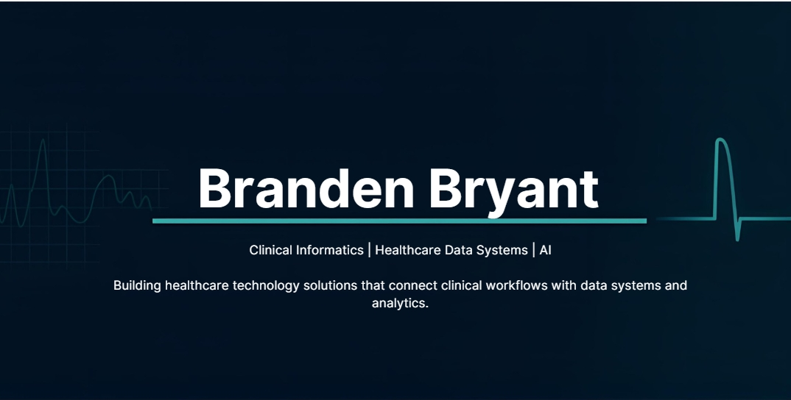

# Branden Bryant

Healthcare technology professional with a background in clinical laboratory science and a focus on building software solutions for healthcare data systems, interoperability, clinical analytics, and AI-driven healthcare tools.

My work focuses on projects involving:

• Healthcare data validation  
• HL7 messaging and interoperability  
• FHIR API integration  
• Clinical laboratory analytics  
• AI applications in healthcare  
• Healthcare system monitoring and integration  

---

# Featured Healthcare Technology Projects

## Transfusion Validation Intelligence Platform (TVIP)

A clinical validation simulation platform designed to demonstrate automated validation workflows for Blood Bank and Blood Establishment Computer Systems (BECS).

Key features:

• Compatibility validation logic  
• Risk analytics dashboard  
• Clinical validation audit logging  
• Certification verification workflow  

Repository  
https://github.com/medlabtech2013/tvip-becs-validation-platform

---

## AI Lab Report Analyzer

A healthcare AI project designed to analyze laboratory test results and identify abnormal clinical values.

Features

• Laboratory data anomaly detection  
• Clinical risk scoring engine  
• Lab trend analytics dashboard  
• AI-assisted clinical data interpretation  

Repository  
https://github.com/medlabtech2013/ai-powered-lab-report-analyzer

---

## HL7 to FHIR Clinical Data Bridge

A healthcare interoperability project that converts HL7 clinical messages into structured FHIR resources.

Features

• HL7 message parsing  
• FHIR resource generation  
• Clinical data transformation pipeline  
• Healthcare API integration  

Repository  
https://github.com/medlabtech2013/hl7-fhir-bridge

---

## Clinical Data Quality Monitor

A healthcare data validation platform designed to analyze HL7 messages and laboratory results to detect data integrity issues during clinical data exchange.

Features

• HL7 message validation  
• Laboratory critical value detection  
• Clinical data quality scoring engine  
• Healthcare validation API  

Repository  
https://github.com/medlabtech2013/clinical-data-quality-monitor

---

## Healthcare Integration Monitor

A healthcare system integration monitoring platform designed to track HL7 interface health and FHIR API performance across clinical systems.

Features

• HL7 interface monitoring  
• FHIR API latency tracking  
• Integration status dashboard  
• Healthcare system monitoring analytics  

Repository  
https://github.com/medlabtech2013/healthcare-integration-monitor

---

# Technology Stack

Python  
FastAPI  
Machine Learning  
HL7 Messaging  
FHIR APIs  
Healthcare Data Systems  
Clinical Informatics  
Data Validation  
API Development  

---

# Professional Background

Medical Laboratory Technician  
Princeton Baptist Medical Center

11+ years of experience in clinical laboratory operations including chemistry, hematology, and blood bank workflows.

Currently transitioning into healthcare technology and clinical data systems with a focus on healthcare interoperability, analytics, and AI-driven clinical applications.

---

# Education

Master of Science – Information Systems (AI Systems Management)  
Strayer University — In Progress

Bachelor of Science – Information Technology (Artificial Intelligence)  
Strayer University

Associate Degree – Medical Laboratory Technology  
Fortis Institute

---

# Areas of Interest

Healthcare Artificial Intelligence  
Clinical Informatics  
Healthcare Interoperability  
Healthcare Data Engineering  
Clinical Analytics  
Healthcare System Integration  

---

# Connect With Me

LinkedIn  
https://www.linkedin.com/in/brandenbryant

GitHub  
https://github.com/medlabtech2013

---

## GitHub Stats

## GitHub Activity

